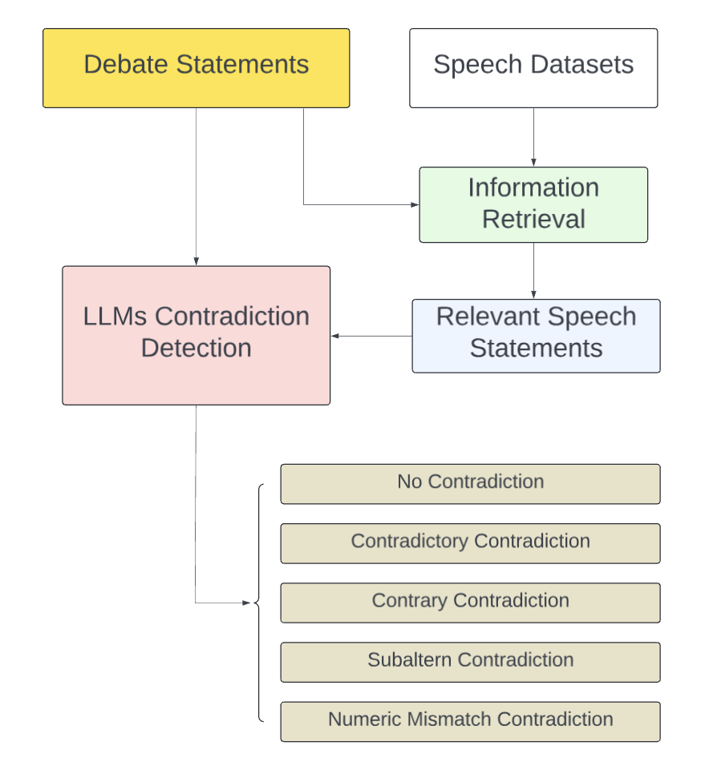

# Automatic Contradiction Detection in Presidential Debate: An LLM's Approach to Promoting Accountability and Informed Citizenship

## Abstract
We present a novel framework for automated contradiction detection in presidential debates using large language models (LLMs). Our approach systematically identifies and classifies contradictions between candidates' debate statements and their past speeches by leveraging advanced LLMs. We analyze statements from the 2024 presidential debate, comparing them against a comprehensive database of 494 speech segments from Donald Trump and 120 from Kamala Harris. The framework categorizes contradictions into four types: Contradictory, Contrary, Subaltern, and Numeric Mismatch.

Our experiments show that Claude 3.5 Sonnet achieves the highest macro precision in detecting contradictions, particularly excelling in identifying numeric mismatches and contrary statements.


Fig1. The Overall Framework of the LLM-based Contradiction Detection on Presidents' Debates

## Results

Each model was prompted to classify pairs of (debate statement, retrieved past-speech segment) into one of the four contradiction categories. Model outputs were scored against human-annotated labels using macro precision and macro recall (`Results/precision.py`, `Results/macro_recall.py`).

**Trump**

| Model | Macro Precision | Macro Recall |
| --- | :---: | :---: |
| Haiku | 0.630 | 0.677 |
| **Sonnet** | **0.700** | **0.879** |
| 4o | 0.667 | 0.644 |
| 4o mini | 0.533 | 0.324 |

**Harris**

| Model | Macro Precision | Macro Recall |
| --- | :---: | :---: |
| Haiku | 0.458 | 0.570 |
| **Sonnet** | **0.875** | **0.981** |
| 4o | 0.750 | 0.731 |
| 4o mini | 0.562 | 0.692 |

Across both candidates, Claude 3.5 Sonnet consistently achieves the best macro precision and macro recall, making it the strongest model in our pipeline for contradiction detection. GPT-4o is the next best performer, while GPT-4o mini and Claude 3.5 Haiku lag behind, particularly on recall for the Trump statement set.

## Repository Structure

```
Content/                     Raw and processed debate/speech transcripts, human annotations, and LLM outputs
Preprocessing/                Cleans and segments debate and speech transcripts
Information Retrieval/        Embeds speech segments and retrieves the most similar past-speech segments for each debate statement (via Qdrant)
LLM Generation/                Classifies debate statements by topic/importance/ideology
Experiment/contradiction.py   Runs the contradiction-detection prompt against each LLM for a given speaker
Evaluation/                    Inter-annotator agreement metrics (ICC, Cohen's Kappa, Krippendorff's alpha) over human annotations
Results/                       Precision/recall scoring scripts and result tables for each model
```

## Setup

1. Clone the repository and install dependencies:

   ```bash
   pip install -r requirements.txt
   pip install anthropic openai qdrant-client python-dotenv pandas scikit-learn tabulate tqdm scipy beautifulsoup4 matplotlib seaborn
   ```

   `requirements.txt` covers the embedding/retrieval stack (`torch`, `sentence_transformers`, `faiss`); the second line installs the remaining packages used across preprocessing, generation, and evaluation.

2. Create a `.env` file in the project root with the following keys:

   ```
   ANTHROPIC_API_KEY=...
   OPENAI_API_KEY=...
   QDRANT_URL=...
   Qdrant_Key=...
   ```

   - `ANTHROPIC_API_KEY` / `Claude_key` — Claude API access for Sonnet/Haiku generation
   - `OPENAI_API_KEY` / `gpt_key` — OpenAI API access for 4o / 4o mini generation
   - `QDRANT_URL`, `Qdrant_Key` (or `Qdrant_Cloud_Key`) — Qdrant vector database used to store speech-segment embeddings and run similarity search

## Reproducing the Pipeline

1. **Preprocess transcripts** — segment the raw debate and speech transcripts into individual statements/segments:
   ```bash
   python "Preprocessing/Debate Transcript Preprocessing/speaker_extraction.py"
   python "Preprocessing/Debate Transcript Preprocessing/segment_transcript.py"
   python "Preprocessing/Speech Transcript Preprocessing/segment_speech_transcript.py"
   ```

2. **Build the speech embedding index** — embed past-speech segments and upload them to Qdrant:
   ```bash
   python "Information Retrieval/embedding.py"
   ```

3. **Retrieve candidate contradictions** — for each debate statement, retrieve the most similar past-speech segments:
   ```bash
   python "Information Retrieval/search_and_save.py"
   ```

4. **Run contradiction detection** — prompt each LLM (Claude 3.5 Sonnet, Claude 3.5 Haiku, GPT-4o, GPT-4o mini) to classify each (statement, retrieved segment) pair:
   ```bash
   python Experiment/contradiction.py
   ```
   Outputs are written per speaker/model to `Results/<Speaker>_<model>/`.

5. **Score against human annotations** — compute macro precision/recall for each model:
   ```bash
   python Results/precision.py
   python Results/macro_recall.py
   ```

6. **(Optional) Check annotator agreement** — measure agreement between human annotators on the gold labels:
   ```bash
   python Evaluation/ICC.py
   python Evaluation/Kappa.py
   python Evaluation/Krippendorff.py
   ```

Human-annotated gold labels used for scoring live under `Content/Annotation` and `Evaluation/Debate Statements`; the aggregated label/model-prediction tables used to produce the results above are in `Results/trump_results.csv` and `Results/harris_results.csv`.
